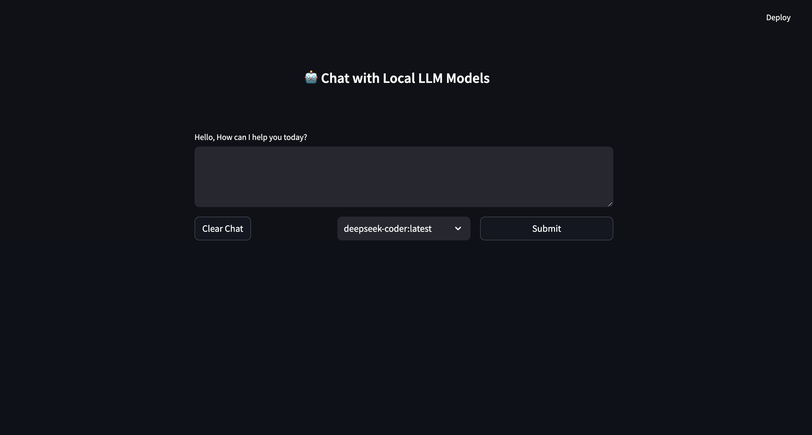

# Doom Local LLM Chat

A Streamlit-based chat interface for Ollama models that allows you to chat with local LLM models.
Works on MacOS that has M1/M2/M3/m4 chips().

## Prerequisites

- Python 3.x
- Ollama installed and running on your system [download here](https://ollama.com/download)

## Installation

### Method 1: Manual Installation

1. Clone this repository or download the files
2. Open Terminal and navigate to the project directory
3. Run the installation script:
   ```bash
    sh run.sh
   ```
4. Open a browser automatically else navigate to `http://localhost:8790`
5. Chat with the different models available

### Method 2: Platypus Installation

1. Download the app from [releases](https://github.com/sachin-philip/Doom/tags)
2. Move app to `~/Applications`
3. Run the Doom. (Note: First time it may take a while to open as it will install the dependencies and its possible that you might need to install ollama separately.)
4. If privacy is enabled you might need to allow the app in `System Preferences` -> `Security & Privacy`

## screenshots


